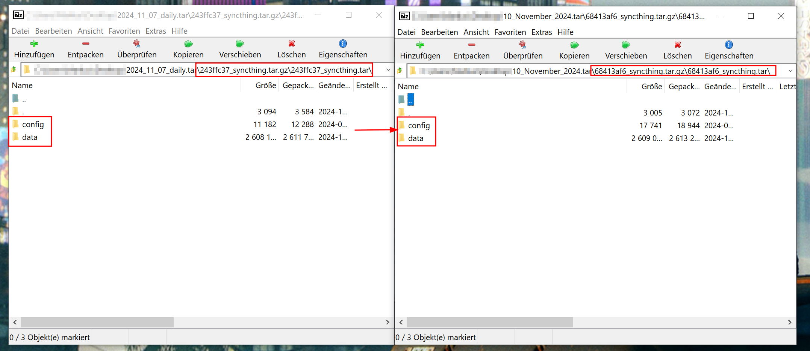

# Migration from Poeschl Home Assistant add-on repostiory

My Home Assistant add-ons were moved to the new repository: https://github.com/Poeschl-HomeAssistant-Addons/repository

To migrate your existing addon config and storage, you will find some quick guides below.

## Migrations

Please determine for yourself which one is fitting for you.
If it's hard to choose, I would recommend the one which transfers the addon data via command line.

Prequisite for all sections below is the integration of the new repository.
[![Add repository to your Home Assistant instance.][repository-badge]][repository-url]

Note that every method below does not delete the data of your old add-on.
This happens when the old add-on is un-installed.

### Migrate addon config only

If your addon doesn't hold any data this fast migration might be for you.

1. Install the new addon (but don't start it)
2. Copy the configuration as YAML from the legacy addon to the new addon
3. Stop the legacy addon
4. Start the new addon
5. Check functionality

### Migrate addon via backup

This is the way if you don't have direct or ssh access to your HA instance.

1. Install the new add-on and start it once and shut it down again
2. Then backup the old and new add-on in separate backup files.
3. Download and open the new and old backup files on your machine
4. Copy all files from the `243ffc37_<addon_slug>.tar` over into the archive from the new add-on in the `68413af6_<addon_slug>.tar`
    
5. Make sure to update/save the changed archive on close
6. Import the modified backup file of the new add-on back into Home Assistant
7. Restore it and verify the new add-on has all data from the old one

### Migrate addon via command line

This is the most direct way to migrate a addon directly.
This happens via ssh access or direct access to your Home Assistant OS.

1. Install the new add-on and start it once and shut it down again
2. Log in with ssh or direct to a terminal
3. Replace the addon slug in the follwing command and execute it

    ```bash
    cp /addon_configs/243ffc37_<addon>/* /addon_configs/68413af6_<addon>/
    ```

4. Start the new addon and verify a successful migration


Thanks for this method to @Dezemberkind

[repository-badge]: https://img.shields.io/badge/Add_addon_repository_to_my-Home%20Assistant-41BDF5?logo=home-assistant&style=for-the-badge
[repository-url]: https://my.home-assistant.io/redirect/supervisor_add_addon_repository/?repository_url=https%3A//github.com/Poeschl-HomeAssistant-Addons/repository
